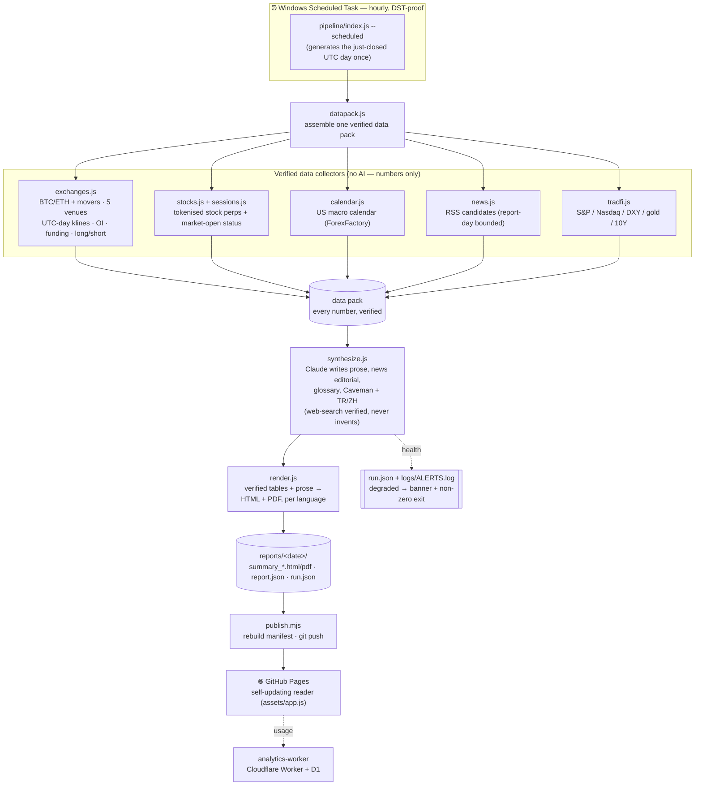
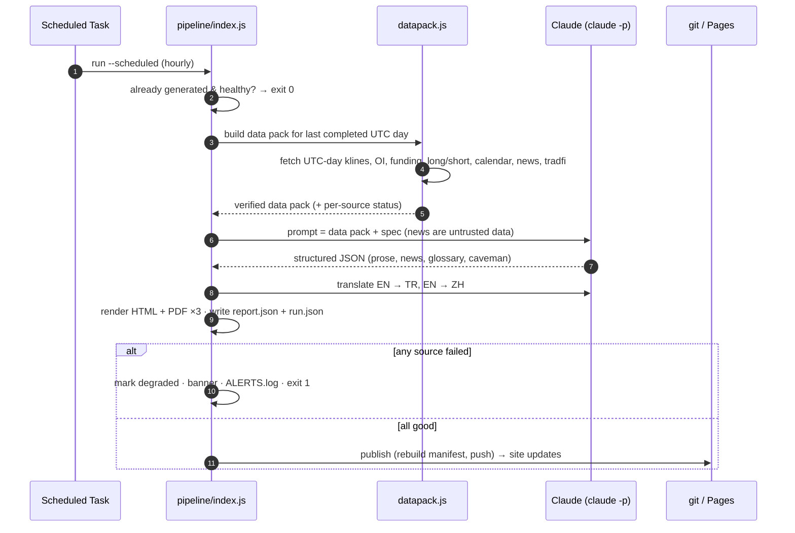
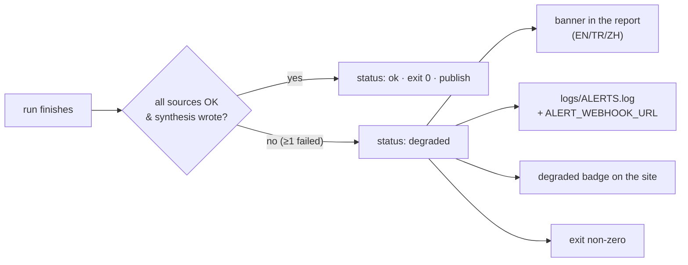

# Futures Daily Report

[](https://gorkemtikic.github.io/futures-daily-report/)
&nbsp;Node ≥ 18 · EN / TR / ZH · covers one full UTC day

A daily, **plain-English** crypto-futures market report for customer-support agents who
don't read finance news. Every night it pulls the same figures from **Binance, Bybit, OKX,
Bitget and Gate**, compares them, has Claude write the story in ordinary words, and
publishes it — in **English, Turkish and Chinese**, plus a one-tap **Caveman mode**
("explain it like I'm 10") — to a searchable website that updates itself.

📊 **Live:** https://gorkemtikic.github.io/futures-daily-report/

> **The one rule that governs everything:** the report never fabricates a number,
> headline, outlet, URL or finding. Every figure comes from an exchange's own API; every
> news item is web-verified with a source. If something can't be verified, its section is
> omitted and the report says so. When in doubt it prints "—", never a guess.

---

## What it answers, every day

1. **Price & volume** — what did each venue's price and volume do over the UTC day, and did they agree?
2. **Positioning** — how were traders leaning? (funding rate, open-interest change, long/short ratio)
3. **Biggest movers** — which coins moved most, and why (with a source) or "no clear public cause"?
4. **Stocks & commodities** — the tokenised stock perps on Binance (Korea, Hong Kong, China, US) and commodities — noting when a cash market was actually closed.
5. **Market news** — the causes that moved prices, grouped and sourced.
6. **Scheduled events** — US releases (with the day's actuals), and what's next.
7. **Glossary** — every finance term used that day, in plain words, rebuilt daily.

---

## How it works



**In words:** a scheduled task wakes hourly and lets the pipeline decide whether the
just-closed UTC day still needs generating. `datapack.js` gathers verified numbers from
five collectors into one **data pack**. `synthesize.js` hands that pack to Claude (`claude -p`
on your subscription) to write *only the words* — never the numbers — with live web search
to verify news. `render.js` lays the verified tables beside the prose and emits HTML + PDF
in three languages. `publish.mjs` pushes it, and GitHub Pages redeploys itself.

### One night, step by step



---

## Where the numbers come from (and how they're made comparable)

Exchanges report the same thing in different units, so everything is normalised before it's
compared — this is where naïve dashboards go wrong:

| Field | Problem across venues | What the pipeline does |
|---|---|---|
| Price / volume | 24h ticker is a *rolling* window, not a calendar day | Uses each venue's **daily (1d) UTC kline**; Bitget's `1D` is UTC+8 so it's rebuilt from hourly candles. Falls back to the 24h ticker only when a kline is missing, and **labels the row** when it does |
| Open interest | coins vs contracts vs USD | Converted to **USD** via each venue's own mark price (Gate's multiplier is required — if missing, OI is "—", never guessed) |
| Volume | base vs quote currency | Uses the daily kline's **quote** volume everywhere; an approximation is marked |
| Funding | different intervals | Stated **annualised** |
| Mark price | some venues don't expose it | Real mark endpoints (e.g. OKX `mark-price`) — never the last price |
| Funding / OI / mark | point-in-time, not daily | Kept, but labelled **"as of HH:MM UTC"** |

Positioning also pulls **open-interest change over the day** and **long/short ratios**
(Binance + OKX/Bybit where available) — all third-party-free.

**Sources:** exchange REST APIs (Binance/Bybit/OKX/Bitget/Gate) · ForexFactory calendar ·
RSS (CoinDesk, The Block, Cointelegraph, Decrypt, SEC, Fed, CFTC) · Twelve Data (trad-fi).
The synthesis step adds web-verified ETF flows and Asian-market context.

---

## Languages, Caveman mode, and honesty signals

- **EN / TR / ZH** — the English report is written first, then *localised* (not literally
  translated) into natural Turkish and Chinese; numbers, tickers, URLs and source names stay put.
- **🦴 Caveman mode** — a one-tap, script-free `<details>` box on every report that explains
  the whole day to a curious 10-year-old, in real names and plain sentences.
- **Honesty signals** — if data fell back to a rolling window, the row is marked `†`; if a
  cash market was closed, that's stated instead of showing drift as a move; if a run was
  degraded, a banner names exactly what was unavailable.

---

## Reliability: nothing fails silently

Every run writes `reports/<date>/run.json` — per-source status, which AI backend actually
ran (and whether it fell back), languages/PDFs produced, the publish result, the data
window, and duration.



A **degraded** run still writes a truthful report — a partial report beats none — but it is
impossible to miss. Check auth any time with `npm run check-narrator`; run the drift guard
with `npm test`.

---

## Commands

```bash
node pipeline/index.js                    # the most recent completed UTC day
node pipeline/index.js --date 2026-09-13  # a specific PAST UTC day (day-bounded klines)
node pipeline/index.js --reuse-synthesis  # reuse cached prose instead of regenerating
npm run check-narrator                    # is claude -p authenticated?
npm test                                  # spec/prompt/renderer drift guard
```

Install the nightly task (hourly, DST-proof, 60-min limit):

```powershell
.\install-scheduler.ps1
```

To hand-write a day's prose, drop `reports/<date>/synthesis.manual.json` (or
`synthesis.tr.manual.json` / `.zh.manual.json`) — a manual file **always wins** and is never
overwritten. `synthesis.auto.json` is the regenerable cache.

---

## Settings (`config.json`)

| Setting | What it does |
|---|---|
| `narrator` | `auto` (API if `ANTHROPIC_API_KEY`, else `claude -p`), `cli`, `api`, or `template` |
| `model` | Which Claude model writes the prose |
| `maxTokens` | Output cap for synthesis/translation |
| `moversMinQuoteVolUSD` | Liquidity floor for a "biggest mover" (below → low-liquidity list) |
| `newsLookbackH` | Hours before 00:00 UTC to still pull news candidates |
| `wallClockMinutes` | Soft budget; over it, translations/publish are skipped and the run is degraded |
| `autoPublish` | Rebuild the manifest and push after each run |

## `.env` (gitignored — names only, never values)

`TRADFI_API_KEY` · `CLAUDE_CODE_OAUTH_TOKEN` (subscription token for the nightly `claude -p`;
refresh ~yearly with `claude setup-token`) · `CLAUDE_CLI_PATH` · optional `ANTHROPIC_API_KEY`
and `ALERT_WEBHOOK_URL`.

---

## Repo layout

```
Futures-Daily-Report/
├─ pipeline/            THE CURRENT GENERATOR
│  ├─ index.js          orchestrator (entry point)
│  ├─ REPORT_SPEC.md    the report spec (source of truth)
│  ├─ datapack.js       assembles one UTC day's verified data
│  ├─ exchanges.js      5-venue UTC-day klines, OI, funding, long/short
│  ├─ stocks.js·sessions.js   tokenised stock perps + cash-session status
│  ├─ calendar.js·news.js·tradfi.js
│  ├─ synthesize.js     Claude writes prose/news/glossary/caveman + TR/ZH
│  ├─ render.js         verified data + prose → HTML + PDF
│  └─ http.js·redact.js·env.js
├─ scripts/             build-manifest · publish · notify · check-narrator
├─ data/market-holidays.json   exchange holidays (verify & extend annually)
├─ analytics-worker/    Cloudflare Worker + D1 (privacy-safe usage analytics)
├─ assets/, index.html  the GitHub Pages site
├─ test/                spec-consistency drift guard
└─ reports/<date>/      summary_*.html/pdf (+ .tr/.zh) · .md · report.json · run.json
```

## Usage analytics

The **Analytics** tab is powered by a small Cloudflare Worker + D1: writes are origin-gated,
rate-limited (per-IP + per-device), IPs are stored only as a **per-day salted HMAC** (never
raw), the admin dashboard is token-gated with `no-store`, and a cron prunes old rows. No
report content is stored. One-time deploy: [`analytics-worker/README.md`](analytics-worker/README.md).

## Notes

- Market data is fetched **directly from the exchanges** — Binance/Bybit need a network they
  allow (this desktop works; a cloud server would be geo-blocked).
- `src/` is the **retired** per-coin "mark-vs-last divergence" generator, kept only so the
  site can still open its old reports. Everything current lives under `pipeline/`.
- **Information only, not financial advice.**
